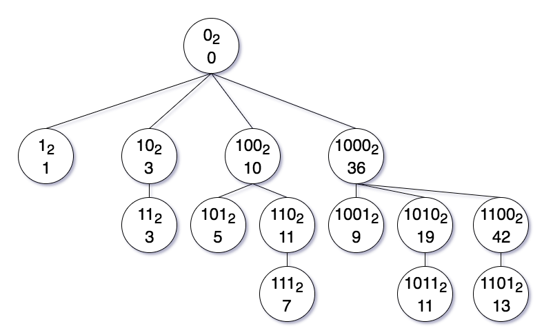

# Fenwick Tree

>A Fenwick tree or binary indexed tree is a data structure that can efficiently update elements and calculate [prefix sums](https://en.wikipedia.org/wiki/Prefix_sum) in a table of numbers. This structure was proposed by Peter Fenwick in 1994 to improve the efficiency of arithmetic coding compression algorithms. - [Wikipedia](https://en.wikipedia.org/wiki/Fenwick_tree)

# Tree Structure
A node in a Fenwick tree has an index and a value. The root's index is 0 and the value is 0. A node's parent is found by clearing the least-significant bit in the index. Given (1-based) sequence, the value of a node is the sum of numbers since the parent's index in the tree. For example, Fenwick tree for the list `[1, 2, 3, 4, 5, 6, 7, 8, 9, 10, 11, 12, 13]` can be drawn as follows.



- Root node has index 0<sub>2</sub> and doesn't correspond to any element of the given 1-based sequence.
- Root node has 4 children indices: 1<sub>2</sub>, 10<sub>2</sub>, 100<sub>2</sub>, 1000<sub>2</sub> because removing the least-significant bit in the index of the children gives the root's index, 0<sub>2</sub>. However, since the last index of the given 1-based sequence is 13 and 10000<sub>2</sub> is greater, it is not a child index of the root.
- Each node stores a value of the partial sum after the parent's index upto the node's index.
- Node with index 1<sub>2</sub> 
  - stores the partial sum: `1 = 1`
  - leaf node because no other least-significant bit can be added to the index
- Node with index 10<sub>2</sub>
  - stores the partial sum: `3 = 1 + 2`
  - has a child with index 11<sub>2</sub>
- Node with index 100<sub>2</sub>
  - stores the partial sum: `10 = 1 + 2 + 3 + 4`
  - has 2 children with indices: 101<sub>2</sub>, 110<sub>2</sub>
- Node with index 1000<sub>2</sub>
  - stores the partial sum: `36 = 1 + 2 + 3 + 4 + 5 + 6 + 7 + 8`
  - has 3 children with indices: 1001<sub>2</sub>, 1010<sub>2</sub>, 1100<sub>2</sub>
- Node with index 110<sub>2</sub>
  - has parent index 100<sub>2</sub> = 4
  - stores the partial sum from index 5 to 6 (=110<sub>2</sub>): `11 = 5 + 6`


# Methods

## prefix_sum( )
- runs in O(log n) time

## append( )
- runs in O(log n) time

## insert( )
- runs in O(n) time

## delete( )
- runs in O(n) time


# Helper Methods

## _parent_index( )
- given a 1-based index, return the index of the parent


```python
def _parent_index(tree_idx):
    """get the parent's index in tree"""
    return tree_idx - _least_significant_bit(tree_idx)

def _least_significant_bit(tree_idx):
    """binary operation to get the least significant bit in a binary index
    because of Python uses a two's complement binary signed integer representation,
    the bits of a binary number and the two's complement only differs in the least
    significant bit.
    
    for example, 
     12 is represented as 00001100
    -12 is represented as 11110100
                        & ________
                   gives  00000100
    which is the least significant bit of 12.
    """
    return tree_idx & -tree_idx

print('12 =', bin(12))
lsb = _least_significant_bit(12)
print('least significant bit:', lsb, '=', bin(lsb))
parent_idx = _parent_index(12)
print('parent index:', parent_idx, '=', bin(parent_idx))
print('least significant bit removed')
```

    12 = 0b1100
    least significant bit: 4 = 0b100
    parent index: 8 = 0b1000
    least significant bit removed

