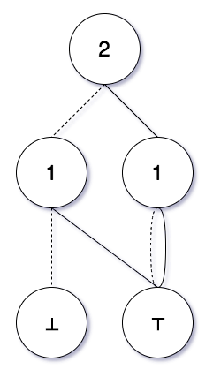

# Zero-suppressed Decision Diagram

>A zero-suppressed decision diagram (ZSDD or ZDD) is a type of binary decision diagram (BDD) based on a new reduction rule, devised by Shin-ichi Minato in 1993. This data structure brings unique and compact representation of sets, often appearing in combinatorial problems. With a modified reduction rule in node elimination, a ZDD distinguishes itself from a BDD by ensuring the canonicity of the representation of the sets. Canonical means that, under certain conditions, an object has only one representation of this kind. Whereas the node in BDDs is removed from the decision tree if both its edges point to the same node, the node in ZDDs is removed if its positive edge points to the constant node 0. The modifications in reduction rule especially improve performance when dealing with sparse sets. - [Wikipedia](https://en.m.wikipedia.org/wiki/Zero-suppressed_decision_diagram)

# Definitions
Definitions are well explained in the Wikipedia link above. The structure of the implemented module is explained here. 

- There are two terminal nodes:
  - The ⊤ node (the TRUE node, also called the base node)
  -	The ⊥ node (the FALSE node, also called the empty node)
- Every node has four attributes:
  - `top` attribute is a positive integer label of the node which represents a variable of the Boolean function.
  - `lo` attribute points to the node which will be reached when the current node is `False`.
  - `hi` attribute points to the node which will be reached when the current node is `True`.
  - `_unique_key` attribute to help identify the nodes, because there can be many different nodes with the same `top` label.
- The `top` value of the TRUE node is `-1` and the `lo` and `hi` attributes are `True`.
- The `top` value of the FALSE node is `-1` and the `lo` and `hi` attributes are `False`.
- The `lo` and `hi` edges always points to a node with a strictly less `top` value.
- The `hi` edge never points to the FALSE node.
- There is exactly one node with zero in-degree, the root node. The root node is either terminal or labelled by the largest integer in the diagram.
- If two nodes have the same `top` label, then their `lo` or `hi` edges point to different nodes. In other words, there are no redundant nodes.
- There is one-to-one correspondence between a ZDD graph, a Boolean function, and a family of sets containing the function variables.
  - ZDD to Boolean function:
    - Every path from the root of the tree to a terminal node represents a combination of input values of the Boolean function.
    - A variable `x` is `True` iff the `hi` edge is followed.
    - A variable `x` is `False` if the `lo` edge is followed.
    - A variable `x` is `False` if it is not present in the path.
  - Canonical family of sets to Boolean function:
    - Every set in the canonical family represents a combination of input values of the Boolean function which makes the output value `True`.
    - A variable `x` is present in a set iff the value of the variable should be `True`.
    - For example, the empty set represents that every variable has `False` value.
# Methods
- To do

# Examples
- The ZDD below represents the function: $f(x_1) = x_1$

  - The canonical family is `{{1}}`

- The ZDD below represents the function: $f(x_1, x_2) = \bar{x_1}x_2 + x_1\bar{x_2}$

  - The canonical family is `{{1}, {2}}`

- The ZDD below represents the function: $f(x_1, x_2) = x_1 + x_2$

  - The canonical family is `{{1}, {2}, {1, 2}}`

- [N Queens Puzzle](./nQueens.ipynb)

f(x, y) = (x + y)  xy